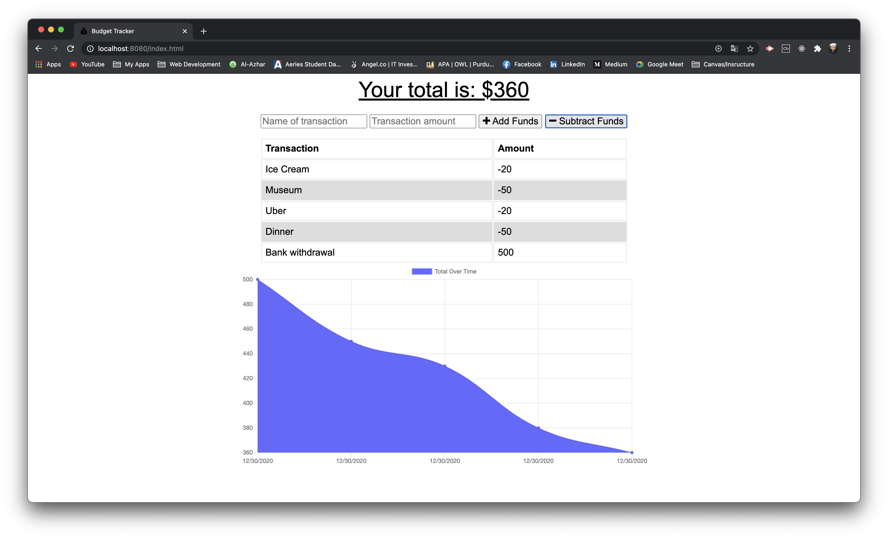

# Budget Tracker

## Description

A budget-tracking PWA that saves offline transactions and uploads them once connected online.

## Table of Contents

- [Deployment URL](#Deployment-URL)
- [Repo URL](#Repo-URL)
- [Installation](#Installation)
- [Cloning](#Cloning)
- [Usage](#Usage)
- [Technologies Used](#Technologies-Used)
- [Questions](#Questions)
- [License](#License)

### Deployment URL

https://ucb-budget-tracker.herokuapp.com/

### Repo URL

https://github.com/ahmadelgamal/ucb-budget-tracker

## Installation

1. This is a web-app. There is no installation required. Simply navigate to the [deployment url](https://ucb-budget-tracker.herokuapp.com/).

## Cloning

1. Install `node.js`.
1. Install `MongoDB`.
1. Download or Clone this repository.
1. If you downloaded the zipped version of this repo, then unzip it in the desired directory.
1. Go to the command line, if you're not there already.
1. Change the directory to `ucb-budget-tracker`.
1. Run: `npm install`.
1. Create a `MongoDB Atlas` Account, if you don't have one already.
1. Create a Production Database in Atlas.
1. Create a `Heroku` Account, if you don't have one already.
1. Create a `Heroku App`.
1. Set Up the Environment Variable in `Heroku`.
1. Deploy to `Heroku`.

## Usage

1. You can add transactions while connected online.
1. You can disconnect from the internet, or simulate it in Chrome DevTools by choosing 'offline' in the 'Network Tab'.
1. You will notice that the app will continue to work without alerts or error messages in the browser (Other than the error messages in the console.)
1. Try adding more transactions while offline.
1. Reconnect to the internet and hit refresh.
1. The offline transactions should stay (persist) in the browser.

### Optional

1. Open a `MongoDB` GUI, such as `MongoDB Compass`.
1. Connect to the database (db): `mongodb://localhost/budget-tracker`.
1. Monitor the updates to the db in response to the added transactions.

### Screenshot / Gif Animation

## Technologies Used

1. JavaScript
1. Node.js
1. Express.js
1. MongoDB
1. Mongoose.js
1. IndexedDB
1. Service Worker
1. Manifest.json

## Questions

Please send your questions and / or comments to **Ahmad El Gamal** at ahmadelgamal@gmail.com, or contact me on [GitHub](https://github.com/ahmadelgamal).

## License

This project is licensed under the terms of the [MIT](https://opensource.org/licenses/MIT) license.
